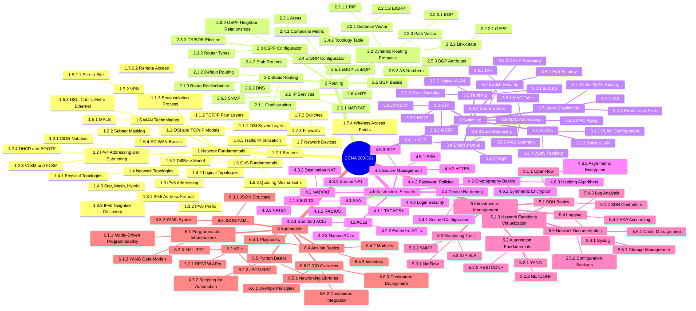

```mermaid
mindmap
  root((CCNA 200-301))
    1 Network Fundamentals
      1.1 OSI and TCP/IP Models
        1.1.1 OSI Seven Layers
        1.1.2 TCP/IP Four Layers
        1.1.3 Encapsulation Process
      1.2 IPv4 Addressing and Subnetting
        1.2.1 CIDR Notation
        1.2.2 Subnet Masking
        1.2.3 VLSM and FLSM
        1.2.4 DHCP and BOOTP
      1.3 IPv6 Addressing
        1.3.1 IPv6 Address Format
        1.3.2 IPv6 Prefix
        1.3.3 IPv6 Neighbor Discovery
      1.4 Network Topologies
        1.4.1 Physical Topologies
        1.4.2 Logical Topologies
        1.4.3 Star, Mesh, Hybrid
      1.5 WAN Technologies
        1.5.1 MPLS
        1.5.2 VPN
          1.5.2.1 Site-to-Site
          1.5.2.2 Remote Access
        1.5.3 DSL, Cable, Metro Ethernet
        1.5.4 SD-WAN Basics
      1.6 QoS Fundamentals
        1.6.1 Traffic Prioritization
        1.6.2 DiffServ Model
        1.6.3 Queuing Mechanisms
      1.7 Network Devices
        1.7.1 Routers
        1.7.2 Switches
        1.7.3 Firewalls
        1.7.4 Wireless Access Points

    2 Routing
      2.1 Static Routing
        2.1.1 Configuration
        2.1.2 Default Routing
        2.1.3 Route Redistribution
      2.2 Dynamic Routing Protocols
        2.2.1 Distance Vector
          2.2.1.1 RIP
          2.2.1.2 EIGRP
        2.2.2 Link-State
          2.2.2.1 OSPF
        2.2.3 Path Vector
          2.2.3.1 BGP
      2.3 OSPF Configuration
        2.3.1 Areas
        2.3.2 Router Types
        2.3.3 DR/BDR Election
        2.3.4 OSPF Neighbor Relationships
      2.4 EIGRP Configuration
        2.4.1 Composite Metric
        2.4.2 Topology Table
        2.4.3 Stub Routers
      2.5 BGP Basics
        2.5.1 eBGP vs iBGP
        2.5.2 AS Numbers
        2.5.3 BGP Attributes
      2.6 IP Services
        2.6.1 NAT/PAT
        2.6.2 DNS
        2.6.3 SNMP
        2.6.4 NTP

    3 Switching
      3.1 VLANs
        3.1.1 VLAN Configuration
        3.1.2 Voice VLAN
        3.1.3 VLAN Trunking
      3.2 Trunking
        3.2.1 802.1Q
        3.2.2 Native VLAN
        3.2.3 Trunk Security
      3.3 STP
        3.3.1 RSTP
        3.3.2 PVSTP
        3.3.3 MSTP
      3.4 EtherChannel
        3.4.1 LACP
        3.4.2 PAgP
        3.4.3 Load Balancing
      3.5 MAC Addressing
        3.5.1 MAC Table
        3.5.2 MAC Learning
        3.5.3 MAC Aging
      3.6 Switch Security
        3.6.1 Port Security
        3.6.2 DHCP Snooping
        3.6.3 DAI
        3.6.4 Storm Control
      3.7 Layer 3 Switching
        3.7.1 SVI
        3.7.2 Inter-VLAN Routing
        3.7.3 Router on a Stick

    4 Infrastructure Security
      4.1 AAA
        4.1.1 TACACS+
        4.1.2 RADIUS
        4.1.3 802.1X
      4.2 ACLs
        4.2.1 Standard ACLs
        4.2.2 Extended ACLs
        4.2.3 Named ACLs
      4.3 NAT/PAT
        4.3.1 Source NAT
        4.3.2 Destination NAT
        4.3.3 NAT64
      4.4 Device Hardening
        4.4.1 Secure Configuration
        4.4.2 Password Policies
        4.4.3 Login Security
      4.5 Secure Management
        4.5.1 SSH
        4.5.2 HTTPS
        4.5.3 SCP
      4.6 Cryptography Basics
        4.6.1 Symmetric Encryption
        4.6.2 Asymmetric Encryption
        4.6.3 Hashing Algorithms

    5 Infrastructure Management
      5.1 SDN Basics
        5.1.1 OpenFlow
        5.1.2 SDN Controllers
        5.1.3 Network Functions Virtualization
      5.2 Automation Fundamentals
        5.2.1 YANG
        5.2.2 NETCONF
        5.2.3 RESTCONF
      5.3 Monitoring Tools
        5.3.1 NetFlow
        5.3.2 SNMP
        5.3.3 IP SLA
      5.4 Logging
        5.4.1 Syslog
        5.4.2 AAA Accounting
        5.4.3 Log Analysis
      5.5 Network Documentation
        5.5.1 Cable Management
        5.5.2 Configuration Backups
        5.5.3 Change Management

    6 Automation
      6.1 Programmable Infrastructure
        6.1.1 Model-Driven Programmability
        6.1.2 YANG Data Models
      6.2 APIs
        6.2.1 RESTful APIs
        6.2.2 JSON-RPC
        6.2.3 XML-RPC
      6.3 JSON/YAML
        6.3.1 JSON Structure
        6.3.2 YAML Syntax
      6.4 Ansible Basics
        6.4.1 Playbooks
        6.4.2 Modules
        6.4.3 Inventory
      6.5 Python Basics
        6.5.1 Networking Libraries
        6.5.2 Scripting for Automation
      6.6 CI/CD Overview
        6.6.1 DevOps Principles
        6.6.2 Continuous Integration
        6.6.3 Continuous Deployment
```