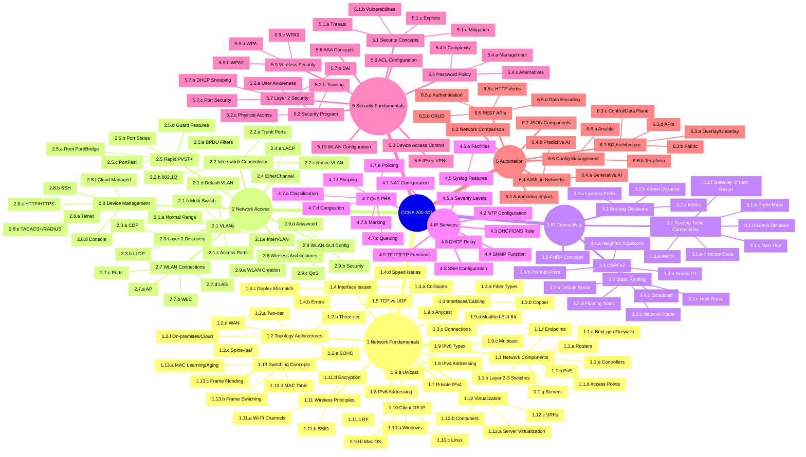

```mermaid
mindmap
  root((CCNA 200-301))
    id((1 Network Fundamentals))
      id[1.1 Network Components]
        id[1.1.a Routers]
        id[1.1.b Layer 2-3 Switches]
        id[1.1.c Next-gen Firewalls]
        id[1.1.d Access Points]
        id[1.1.e Controllers]
        id[1.1.f Endpoints]
        id[1.1.g Servers]
        id[1.1.h PoE]
      id[1.2 Topology Architectures]
        id[1.2.a Two-tier]
        id[1.2.b Three-tier]
        id[1.2.c Spine-leaf]
        id[1.2.d WAN]
        id[1.2.e SOHO]
        id[1.2.f On-premises/Cloud]
      id[1.3 Interfaces/Cabling]
        id[1.3.a Fiber Types]
        id[1.3.b Copper]
        id[1.3.c Connections]
      id[1.4 Interface Issues]
        id[1.4.a Collisions]
        id[1.4.b Errors]
        id[1.4.c Duplex Mismatch]
        id[1.4.d Speed Issues]
      id[1.5 TCP vs UDP]
      id[1.6 IPv4 Addressing]
      id[1.7 Private IPv4]
      id[1.8 IPv6 Addressing]
      id[1.9 IPv6 Types]
        id[1.9.a Unicast]
        id[1.9.b Anycast]
        id[1.9.c Multicast]
        id[1.9.d Modified EUI-64]
      id[1.10 Client OS IP]
        id[1.10.a Windows]
        id[1.10.b Mac OS]
        id[1.10.c Linux]
      id[1.11 Wireless Principles]
        id[1.11.a Wi-Fi Channels]
        id[1.11.b SSID]
        id[1.11.c RF]
        id[1.11.d Encryption]
      id[1.12 Virtualization]
        id[1.12.a Server Virtualization]
        id[1.12.b Containers]
        id[1.12.c VRFs]
      id[1.13 Switching Concepts]
        id[1.13.a MAC Learning/Aging]
        id[1.13.b Frame Switching]
        id[1.13.c Frame Flooding]
        id[1.13.d MAC Table]

    id((2 Network Access))
      id[2.1 VLANs]
        id[2.1.a Normal Range]
        id[2.1.b Multi-Switch]
        id[2.1.c Access Ports]
        id[2.1.d Default VLAN]
        id[2.1.e InterVLAN]
      id[2.2 Interswitch Connectivity]
        id[2.2.a Trunk Ports]
        id[2.2.b 802.1Q]
        id[2.2.c Native VLAN]
      id[2.3 Layer 2 Discovery]
        id[2.3.a CDP]
        id[2.3.b LLDP]
      id[2.4 EtherChannel]
        id[2.4.a LACP]
      id[2.5 Rapid PVST+]
        id[2.5.a Root Port/Bridge]
        id[2.5.b Port States]
        id[2.5.c PortFast]
        id[2.5.d Guard Features]
        id[2.5.e BPDU Filters]
      id[2.6 Wireless Architectures]
      id[2.7 WLAN Connections]
        id[2.7.a AP]
        id[2.7.b WLC]
        id[2.7.c Ports]
        id[2.7.d LAG]
      id[2.8 Device Management]
        id[2.8.a Telnet]
        id[2.8.b SSH]
        id[2.8.c HTTP/HTTPS]
        id[2.8.d Console]
        id[2.8.e TACACS+/RADIUS]
        id[2.8.f Cloud Managed]
      id[2.9 WLAN GUI Config]
        id[2.9.a WLAN Creation]
        id[2.9.b Security]
        id[2.9.c QoS]
        id[2.9.d Advanced]

    id((3 IP Connectivity))
      id[3.1 Routing Table Components]
        id[3.1.a Protocol Code]
        id[3.1.b Prefix/Mask]
        id[3.1.c Next Hop]
        id[3.1.d Admin Distance]
        id[3.1.e Metric]
        id[3.1.f Gateway of Last Resort]
      id[3.2 Routing Decisions]
        id[3.2.a Longest Prefix]
        id[3.2.b Admin Distance]
        id[3.2.c Metric]
      id[3.3 Static Routing]
        id[3.3.a Default Route]
        id[3.3.b Network Route]
        id[3.3.c Host Route]
        id[3.3.d Floating Static]
      id[3.4 OSPFv2]
        id[3.4.a Neighbor Adjacency]
        id[3.4.b Point-to-Point]
        id[3.4.c Broadcast]
        id[3.4.d Router ID]
      id[3.5 FHRP Concepts]

    id((4 IP Services))
      id[4.1 NAT Configuration]
      id[4.2 NTP Configuration]
      id[4.3 DHCP/DNS Role]
      id[4.4 SNMP Function]
      id[4.5 Syslog Features]
        id[4.5.a Facilities]
        id[4.5.b Severity Levels]
      id[4.6 DHCP Relay]
      id[4.7 QoS PHB]
        id[4.7.a Classification]
        id[4.7.b Marking]
        id[4.7.c Queuing]
        id[4.7.d Congestion]
        id[4.7.e Policing]
        id[4.7.f Shaping]
      id[4.8 SSH Configuration]
      id[4.9 TFTP/FTP Functions]

    id((5 Security Fundamentals))
      id[5.1 Security Concepts]
        id[5.1.a Threats]
        id[5.1.b Vulnerabilities]
        id[5.1.c Exploits]
        id[5.1.d Mitigation]
      id[5.2 Security Program]
        id[5.2.a User Awareness]
        id[5.2.b Training]
        id[5.2.c Physical Access]
      id[5.3 Device Access Control]
      id[5.4 Password Policy]
        id[5.4.a Management]
        id[5.4.b Complexity]
        id[5.4.c Alternatives]
      id[5.5 IPsec VPNs]
      id[5.6 ACL Configuration]
      id[5.7 Layer 2 Security]
        id[5.7.a DHCP Snooping]
        id[5.7.b DAI]
        id[5.7.c Port Security]
      id[5.8 AAA Concepts]
      id[5.9 Wireless Security]
        id[5.9.a WPA]
        id[5.9.b WPA2]
        id[5.9.c WPA3]
      id[5.10 WLAN Configuration]

    id((6 Automation))
      id[6.1 Automation Impact]
      id[6.2 Network Comparison]
      id[6.3 SD Architecture]
        id[6.3.a Overlay/Underlay]
        id[6.3.b Fabric]
        id[6.3.c Control/Data Plane]
        id[6.3.d APIs]
      id[6.4 AI/ML in Networks]
        id[6.4.a Generative AI]
        id[6.4.b Predictive AI]
      id[6.5 REST APIs]
        id[6.5.a Authentication]
        id[6.5.b CRUD]
        id[6.5.c HTTP Verbs]
        id[6.5.d Data Encoding]
      id[6.6 Config Management]
        id[6.6.a Ansible]
        id[6.6.b Terraform]
      id[6.7 JSON Components]
```