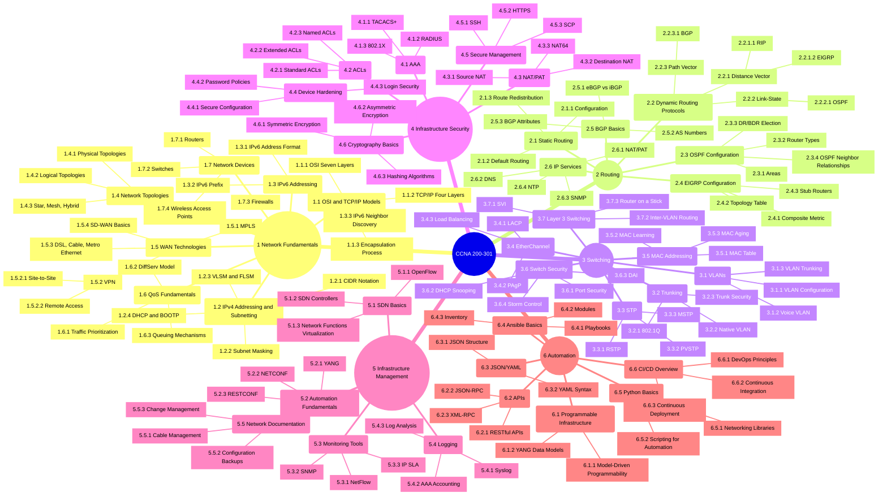

```mermaid
mindmap
  root((CCNA 200-301))
    id((1 Network Fundamentals))
      id(1.1 OSI and TCP/IP Models)
        id[1.1.1 OSI Seven Layers]
        id[1.1.2 TCP/IP Four Layers]
        id[1.1.3 Encapsulation Process]
      id(1.2 IPv4 Addressing and Subnetting)
        id[1.2.1 CIDR Notation]
        id[1.2.2 Subnet Masking]
        id[1.2.3 VLSM and FLSM]
        id[1.2.4 DHCP and BOOTP]
      id(1.3 IPv6 Addressing)
        id[1.3.1 IPv6 Address Format]
        id[1.3.2 IPv6 Prefix]
        id[1.3.3 IPv6 Neighbor Discovery]
      id(1.4 Network Topologies)
        id[1.4.1 Physical Topologies]
        id[1.4.2 Logical Topologies]
        id[1.4.3 Star, Mesh, Hybrid]
      id(1.5 WAN Technologies)
        id[1.5.1 MPLS]
        id[1.5.2 VPN]
          id[1.5.2.1 Site-to-Site]
          id[1.5.2.2 Remote Access]
        id[1.5.3 DSL, Cable, Metro Ethernet]
        id[1.5.4 SD-WAN Basics]
      id(1.6 QoS Fundamentals)
        id[1.6.1 Traffic Prioritization]
        id[1.6.2 DiffServ Model]
        id[1.6.3 Queuing Mechanisms]
      id(1.7 Network Devices)
        id[1.7.1 Routers]
        id[1.7.2 Switches]
        id[1.7.3 Firewalls]
        id[1.7.4 Wireless Access Points]

    id((2 Routing))
      id(2.1 Static Routing)
        id[2.1.1 Configuration]
        id[2.1.2 Default Routing]
        id[2.1.3 Route Redistribution]
      id(2.2 Dynamic Routing Protocols)
        id[2.2.1 Distance Vector]
          id[2.2.1.1 RIP]
          id[2.2.1.2 EIGRP]
        id[2.2.2 Link-State]
          id[2.2.2.1 OSPF]
        id[2.2.3 Path Vector]
          id[2.2.3.1 BGP]
      id(2.3 OSPF Configuration)
        id[2.3.1 Areas]
        id[2.3.2 Router Types]
        id[2.3.3 DR/BDR Election]
        id[2.3.4 OSPF Neighbor Relationships]
      id(2.4 EIGRP Configuration)
        id[2.4.1 Composite Metric]
        id[2.4.2 Topology Table]
        id[2.4.3 Stub Routers]
      id(2.5 BGP Basics)
        id[2.5.1 eBGP vs iBGP]
        id[2.5.2 AS Numbers]
        id[2.5.3 BGP Attributes]
      id(2.6 IP Services)
        id[2.6.1 NAT/PAT]
        id[2.6.2 DNS]
        id[2.6.3 SNMP]
        id[2.6.4 NTP]

    id((3 Switching))
      id(3.1 VLANs)
        id[3.1.1 VLAN Configuration]
        id[3.1.2 Voice VLAN]
        id[3.1.3 VLAN Trunking]
      id(3.2 Trunking)
        id[3.2.1 802.1Q]
        id[3.2.2 Native VLAN]
        id[3.2.3 Trunk Security]
      id(3.3 STP)
        id[3.3.1 RSTP]
        id[3.3.2 PVSTP]
        id[3.3.3 MSTP]
      id(3.4 EtherChannel)
        id[3.4.1 LACP]
        id[3.4.2 PAgP]
        id[3.4.3 Load Balancing]
      id(3.5 MAC Addressing)
        id[3.5.1 MAC Table]
        id[3.5.2 MAC Learning]
        id[3.5.3 MAC Aging]
      id(3.6 Switch Security)
        id[3.6.1 Port Security]
        id[3.6.2 DHCP Snooping]
        id[3.6.3 DAI]
        id[3.6.4 Storm Control]
      id(3.7 Layer 3 Switching)
        id[3.7.1 SVI]
        id[3.7.2 Inter-VLAN Routing]
        id[3.7.3 Router on a Stick]

    id((4 Infrastructure Security))
      id(4.1 AAA)
        id[4.1.1 TACACS+]
        id[4.1.2 RADIUS]
        id[4.1.3 802.1X]
      id(4.2 ACLs)
        id[4.2.1 Standard ACLs]
        id[4.2.2 Extended ACLs]
        id[4.2.3 Named ACLs]
      id(4.3 NAT/PAT)
        id[4.3.1 Source NAT]
        id[4.3.2 Destination NAT]
        id[4.3.3 NAT64]
      id(4.4 Device Hardening)
        id[4.4.1 Secure Configuration]
        id[4.4.2 Password Policies]
        id[4.4.3 Login Security]
      id(4.5 Secure Management)
        id[4.5.1 SSH]
        id[4.5.2 HTTPS]
        id[4.5.3 SCP]
      id(4.6 Cryptography Basics)
        id[4.6.1 Symmetric Encryption]
        id[4.6.2 Asymmetric Encryption]
        id[4.6.3 Hashing Algorithms]

    id((5 Infrastructure Management))
      id(5.1 SDN Basics)
        id[5.1.1 OpenFlow]
        id[5.1.2 SDN Controllers]
        id[5.1.3 Network Functions Virtualization]
      id(5.2 Automation Fundamentals)
        id[5.2.1 YANG]
        id[5.2.2 NETCONF]
        id[5.2.3 RESTCONF]
      id(5.3 Monitoring Tools)
        id[5.3.1 NetFlow]
        id[5.3.2 SNMP]
        id[5.3.3 IP SLA]
      id(5.4 Logging)
        id[5.4.1 Syslog]
        id[5.4.2 AAA Accounting]
        id[5.4.3 Log Analysis]
      id(5.5 Network Documentation)
        id[5.5.1 Cable Management]
        id[5.5.2 Configuration Backups]
        id[5.5.3 Change Management]

    id((6 Automation))
      id(6.1 Programmable Infrastructure)
        id[6.1.1 Model-Driven Programmability]
        id[6.1.2 YANG Data Models]
      id(6.2 APIs)
        id[6.2.1 RESTful APIs]
        id[6.2.2 JSON-RPC]
        id[6.2.3 XML-RPC]
      id(6.3 JSON/YAML)
        id[6.3.1 JSON Structure]
        id[6.3.2 YAML Syntax]
      id(6.4 Ansible Basics)
        id[6.4.1 Playbooks]
        id[6.4.2 Modules]
        id[6.4.3 Inventory]
      id(6.5 Python Basics)
        id[6.5.1 Networking Libraries]
        id[6.5.2 Scripting for Automation]
      id(6.6 CI/CD Overview)
        id[6.6.1 DevOps Principles]
        id[6.6.2 Continuous Integration]
        id[6.6.3 Continuous Deployment]
```